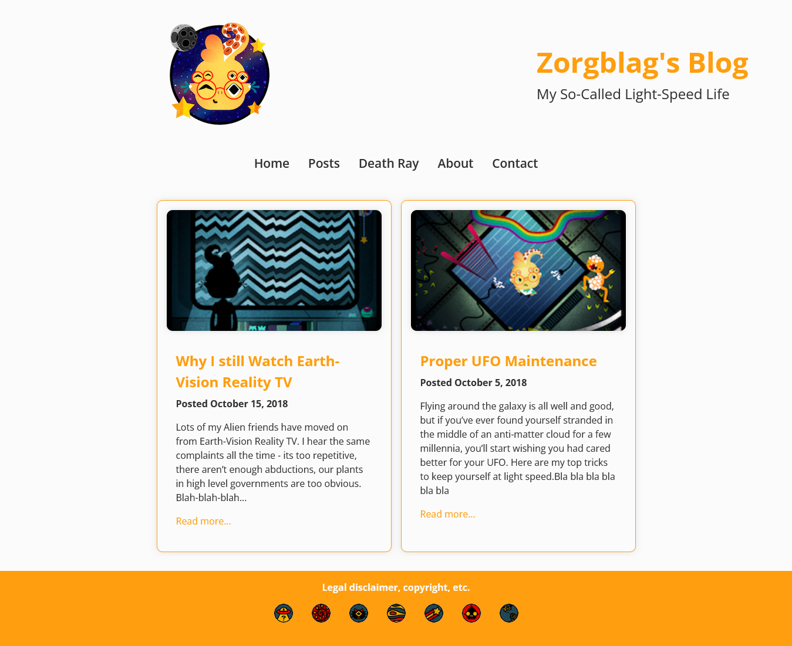

# Frontend Masters Blog Page

A responsive and visually appealing blog page designed as an exercise to enhance frontend development skills. This project focuses on clean design, responsive layouts, and user-friendly interactivity.

## Features

- Responsive design for mobile, tablet, and desktop screens.
- Blog cards with images, titles, descriptions, and hover effects.
- Consistent typography and styling.
- Optimized layout for readability.

## Screenshots

## Technologies Used

- **HTML5**: Semantic and accessible structure.
- **CSS3**: Styling for layout, typography, and responsiveness.

## Live Preview

[Live](https://radiant-hummingbird-0178b7.netlify.app)
